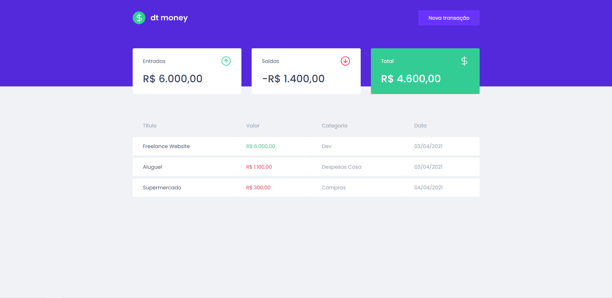
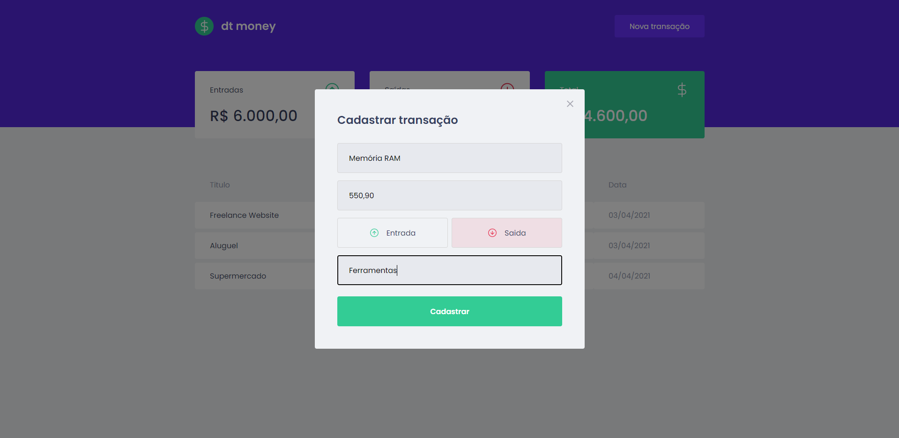

# 💲 DT-MONEY
<p align="center">
  :moneybag: O objetivo deste projeto é gerenciar o seu dinheiro através dos registros de entradas e saídas
</p>

<p align="center" style="font-weight: bold;">Desenvolvido durante o segundo módulo do Ignite | <a href="https://rocketseat.com.br/">Rocketseat</a></p>

# 📌 Contents

* [Screenshots](#camera-screenshot)
* [Technologies](#rocket-technologies)
* [How to Run](#computer-how-to-run)
* [Issues](#bug-issues)
* [Contributing](#sparkles-issues)
* [License](#page_facing_up-license)

# :camera: Screenshots
<div align="center">
   
   
</div>

# :rocket: Technologies
This project was made using the follow technologies:

* [React](https://reactjs.org/)
* [Typescript](https://www.typescriptlang.org/)
* [Styled Components](https://styled-components.com/)
* [Polished](https://polished.js.org/)
* [MirageJS](https://miragejs.com/)
* [Axios](https://github.com/axios/axios)

# :computer: How to run

```bash
# Clone Repository
$ git clone https://github.com/vitorezende/dtmoney.git && cd dtmoney

# Install Dependencies
$ yarn

# Run Aplication
$ yarn start
```
Go to http://localhost:3000/ to see the application running.

# :bug: Issues

Create a <a href="https://github.com/vitorezende/dtmoney/issues">new issue report</a>, it will be an honor to be able to help you solve and further improve our application.

# :sparkles: Contributing

- Fork this repository;
- Create a new branch to develop your feature: `git checkout -b my-feature`;
- Commit your changes: `git commit -m 'feat: my new feature'`;
- Push to your branch: `git push origin my-feature`.

# :page_facing_up: License

This project is under the [MIT License](./LICENSE) |
Made with 💖 by [Vitor Rezende](https://www.linkedin.com/in/vitorvrc/).
